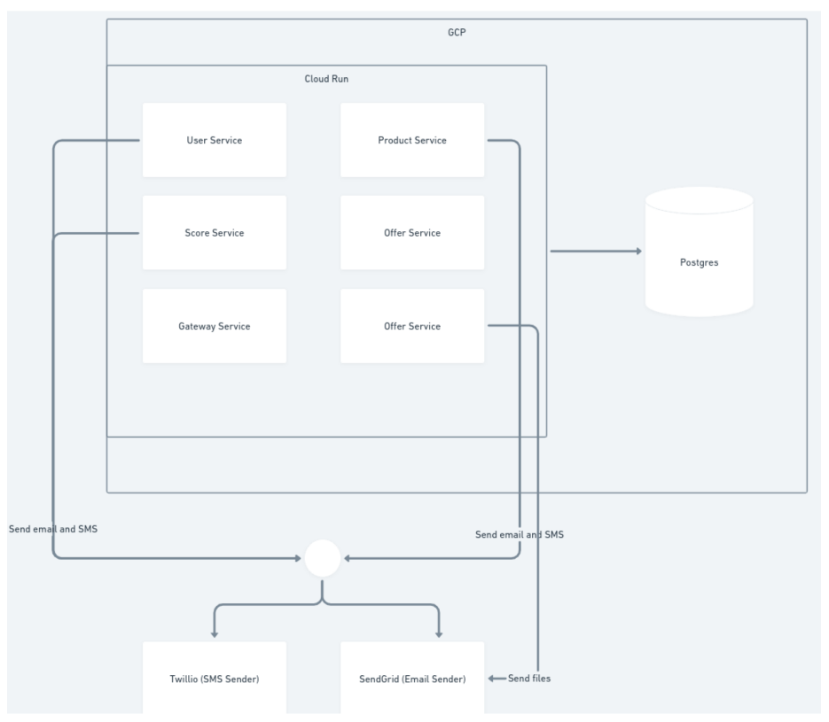
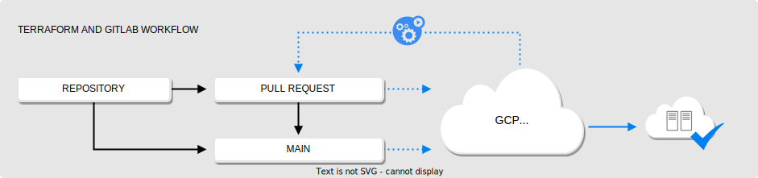
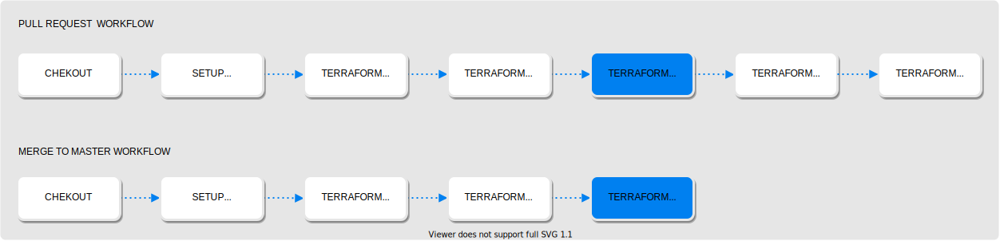

# Remodelação de Infraestrutura e Arquitetura
Este repositório contém um projeto de arquitetura baseada em contêineres usando o GKE. O projeto usa os recursos do GKE para gerenciar as cargas de trabalho em contêineres de forma escalável, segura e eficiente na nuvem do Google.te para executar aplicações em contêineres na nuvem do Google.

# Desafio Proposto
Esse processo envolve uma série de desafios técnicos em relação aos dados processamento e integração com parceiros. O contexto desse desafio é desenhar o próximo passo de nossa solução mudando para Kubernetes e melhorando a infraestrutura devops da figura abaixo:

  <p align="center">
    
  </p>

## Objetivos:

### Obrigatórios

* Construir um ambiente com o Kubernetes;
* Implementar solução de monitoramento e alertas;
* Melhorar a forma como estamos enviando mensagens e sms;
* Dar soluções para ter uma plataforma para gerenciar arquivos pois o fluxo é de arquivos é bem alto;
* Considerar que precisarei construir esse ambiente para em múltiplos países;

### Desejáveis

* Definição do funcionamento das esteiras de CI/CD, dando preferencia ao GitLab;
* Definir como será gerenciada a infraestrutura;
* Dar preferencias aos Recusos do Google Cloud Plataform;
* Definir uma estratégia pra migração;

# Desenvolvimento

## Nova Infraestrutura

No Diagrama abaixo foi remodelado levando em considerações alguns requistios dados para a migração. 
Considerei a criação de um ambiente escalavel e mais seguro utilizando redundancia de regiões entre muilplos nós em um Serviço de Kubernets oferecido como o serviço no GCP, como está destacado na cor amarela, os node pools estão em uma única região, mas dividindo os recursos em zonas diferentes da mesma região. Um node pool pode ser escalável assim como a replica de pods.

Existe um node pool especifico para os workloads do sistema assim como também aplicações que integram o ecosistema da infra (istio, ngnix, let's encrypt, etc). Essa movimentação permite que os workloads do funcionamento do kuberntes não interfira nos workloads das aplicações. Bem, assim como o systema as aplicações também são segregadas por node pools.

  <p align="center">
    
  </p>

Um ponto importante aqui é o banco de dados é consumido por todos as aplicações, talvez no futuro podemos criar mais alguns bancos de dados para retirar a dependencia de apenas um banco, além de criarmos rotinas de backups. Optei por utilizar o serviço do Postgres na própria plataforma do GCP. 

O micro serviço offer, gera bastante arquivos para enviar via email. Pensando em uma solução que fosse dentro do ambiente Google, eu pensei no Cloud Storage que trás uma versatilidade nos tipos de arquivos além de ser robusto para suportar a massa de dados.

Os outros micro serviços mandam email e sms como resultado final da execução, logo uma fila para consumir todas essas mensagens é necessário, dentro do eco sistema google, implementei o Pub/Sub para consumir e publicar as mensagens de forma organizada, segura e rápida para o Send Grid e Twillio. 

Por fim o balanceamento de carga e getway vou criar dois tópicos a parte, pois são pontos importantes para nossa infra, pois essas soluções são a porta de entrada da nossa infra.

PS.: A replicação dos ambientes por região será abordada no ponto "CI/CD"

### Api Gatway
Imagine que você tem um serviço na nuvem do Google que faz alguma coisa, como processar imagens ou calcular impostos. Você quer que outras pessoas ou aplicações possam usar esse serviço de forma fácil e segura, sem precisar saber como ele funciona por dentro. Para isso, você precisa criar uma API, que é uma interface que define como o seu serviço pode ser acessado e quais são os dados de entrada e saída. Uma API é como um cardápio de restaurante, que mostra quais são os pratos disponíveis e como pedi-los.

O Google API Gateway é um serviço que te ajuda a criar e gerenciar essas APIs para os seus serviços na nuvem do Google. Você pode usar o Google API Gateway para definir quais são as rotas, os parâmetros e os formatos da sua API, e ele vai cuidar de todo o resto. Ele vai garantir que as pessoas ou aplicações que querem usar o seu serviço tenham permissão para isso, usando chaves ou tokens de autenticação. Ele também vai monitorar o uso da sua API, registrando as chamadas, os erros e o tempo de resposta. Ele também vai escalar a sua API de acordo com a demanda, sem que você precise se preocupar com isso.

### Ingress Controler

O Ingress é um recurso do Kubernetes que permite configurar um balanceador de carga HTTP para aplicativos executados no Kubernetes, representado por um ou mais Services . Esse balanceador de carga é necessário para entregar esses aplicativos a clientes fora do cluster Kubernetes.

O recurso Ingress é compatível com os seguintes recursos:

* Roteamento baseado em conteúdo :
    * Roteamento baseado em host . Por exemplo, encaminhar solicitações com o header do host `foo.example.com` para um grupo de serviços e o header do host `bar.example.com` para outro grupo.
    * Roteamento baseado em caminho. Por exemplo, as solicitações de roteamento com o URI que começa com `/serviceA` o serviço A e as solicitações com o URI que começa com `/serviceB` o serviço B.

* Terminação TLS/SSL para cada nome de host, como `foo.example.com`.

O Ingress Controller é um aplicativo que é executado em um cluster e configura um balanceador de carga HTTP de acordo com os recursos do Ingress. O balanceador de carga pode ser um balanceador de carga de software executado no cluster ou um balanceador de carga de hardware ou de nuvem executado externamente. Diferentes balanceadores de carga exigem diferentes implementações do Ingress Controller.

No caso do NGINX, o Ingress Controller é implantado em um pod junto com o balanceador de carga.

<p align="center">
    
</p>


## CI/CD

### Provisionamento Ambiente via Terraform


Nós iremos utilziar o terraform e Gitlab para o provisionamento automatizado do ambiente, logo quando necessário o provisionamento de um novo ambiente em uma nova região é apenas replicar o código e configurar as variaveis necessárias.

A trigger da esteira do Gitlab adicionam integração contínua aos repositórios do Gitlab para automatizar os deploys, testes e implantações de software. Automatizar o Terraform com CI/CD reforça as melhores práticas de configuração, promove a colaboração e automatiza o fluxo de trabalho do Terraform.

<p align="center">

</p>

O fluxo de trabalho irá:

*  **Verificar se a configuração está formatada** corretamente para demonstrar como você pode aplicar as práticas recomendadas.
* Gerar um plan para cada pull request.
* Salvar os estados em um storage account do Azure.
* **Apply** a configuração ao realizar push na branch `main`.


#### Fluxo de trabalho de ações de revisão

Essas etapas abaixo definem todas as ações no fluxo de trabalho. No entanto, esse trabalho não é executado em todas as etapas quando você aciona a ação. Algumas dessas etapas são executadas apenas a partir de solicitações pull, outros só são executados quando você mescla um commit para `main`.

<p align="center">

</p>


### GitOps Model


#### Visão geral

GitOps é uma abordagem para implantação contínua para aplicativos nativos da nuvem. Ele se concentra em uma experiência centrada no desenvolvedor ao operar a infraestrutura, usando ferramentas com as quais os desenvolvedores já estão familiarizados, incluindo Git e ferramentas de implantação contínua.

A ideia central do GitOps é ter um repositório Git que sempre contenha uma descrição declarativa da infraestrutura atualmente exigida no ambiente de produção, e um processo automatizado que corresponda o ambiente de produção ao estado descrito no repositório. Esteja você implantando um novo aplicativo ou atualizando um existente, basta atualizar o repositório - o processo automatizado cuida de todo o resto. É como usar o controle de cruzeiro para gerenciar aplicativos em produção.

#### Por que utilizr o GitOps?

* Deployment com mais frequência e rapidez 
    > Quando dizemos "alta velocidade", queremos dizer que cada equipe de produto pode enviar atualizações com segurança várias vezes ao dia - implemente-as imediatamente, observe os resultados em tempo real e use esse feedback para avançar ou retroceder.
    — <cite>Tecelagem</cite>
* Recuperação de erros fácil e rápida
    > O registro do Git não é apenas um log de auditoria, mas também um log de transações. Você pode reverter e retroceder de forma instantânea.
    — <cite>Alexis Richardson</cite>
* Gerenciamento de credenciais mais fácil
    > O GitOps permite gerenciar implantações inteiramente do seu ambiente. Para isso, seu ambiente precisa apenas de acesso ao seu repositório e registro de imagens. É isso. Você não precisa dar aos desenvolvedores acesso direto ao ambiente.
* Implantações de arquivos auto gerenciados
    > Com o GitOps, toda mudança em qualquer ambiente deve acontecer por meio do repositório. Você sempre pode verificar a branch main e obter uma descrição completa do que é implantado onde, além do histórico completo de todas as alterações já feitas no sistema. E você obtém uma trilha de auditoria de todas as alterações em seu sistema gratuitamente!
* Conhecimento compartilhado em equipes
    > Usar o Git para armazenar descrições completas de sua infraestrutura implantada permite que todos em sua equipe verifiquem sua evolução ao longo do tempo. Com ótimas mensagens de confirmação, todos podem reproduzir o processo de pensamento de mudança de infraestrutura e também encontrar facilmente exemplos de como configurar novos sistemas.

#### Como o GitOps funciona?

O GitOps organiza o processo de implantação em torno de repositórios de código como o elemento central. Existem pelo menos dois repositórios: o repositório de aplicativos e o repositório de configuração do ambiente. O repositório do aplicativo contém o código-fonte do aplicativo e os manifestos de implantação para implantar o aplicativo. O repositório de configuração do ambiente contém todos os manifestos de implementação da infraestrutura atualmente desejada de um ambiente de implementação. Ele descreve quais aplicativos e serviços de infraestrutura (mediador de mensagens, malha de serviço, ferramenta de monitoramento, …) devem ser executados com qual configuração e versão no ambiente de implantação.

  <p align="center">
  
  </p>

#### ArgoCD

ArgoCD é um controlador GitOps criado especificamente para implantações do Kubernetes. Ele suporta uma variedade de ferramentas de gerenciamento de configuração como Helm (veja nossa documentação para mais informações), Ksonnet, Kustomize , etc. O componente principal é o Application Controller, que monitora continuamente qualquer aplicativo em execução e compara o estado ativo com o estado desejado definido em um repositório Git.

Se um aplicativo implantado cujo estado ativo se desviar do estado de destino, o ArgoCD será considerado OutOfSync. Em seguida, ele fornece relatórios e visualizações para identificar essas alterações e pode fornecer automação quando quaisquer modificações são feitas para que os ambientes de destino reflitam o estado desejado de um sistema no Git.

  <p align="center">
  
  </p>

#### Kustomize 

Kustomize é um gerenciador de configuração de CLI para objetos Kubernetes que aproveita a camada para preservar as configurações básicas do aplicativo. Isso é feito sobrepondo os artefatos YAML declarativos para substituir as configurações padrão sem realmente fazer alterações no manifesto original.

As configurações do Kustomize são definidas em um arquivo kustomization.yaml. Kustomize também é integrado ao kubectl. Com o Kustomize, você pode configurar arquivos YAML brutos e sem modelo, o que permite modificar facilmente as configurações entre implantação e produção. Isso permite a solução de problemas de configurações incorretas e mantém intactas as substituições de personalização específicas do caso de uso.

O Kustomize também permite que você dimensione facilmente reutilizando um arquivo base em todos os seus ambientes (desenvolvimento, produção, homologação etc.) e, em seguida, sobreponha as especificações de cada um.

- **Base Layer**: Essa camada especifica os recursos mais comuns e a configuração original.
- **Overlays Layer**: Essa camada especifica recursos específicos do caso de uso, utilizando patches para substituir outros arquivos de personalização e manifestos do Kubernetes.

##### Por que Utilizar o Kustomize?

Kustomize oferece alguns dos seguintes benefícios:

1. **Reutilização:**

    Com Kustomize você pode reutilizar um dos arquivos base em todos os ambientes (desenvolvimento, homologação, produção, etc.) e especificações de sobreposição para cada um desses ambientes.

2. **Geração rápida:**
    
    Como o Kustomize não utiliza modelos, um arquivo YAML padrão pode ser usado para declarar as configurações.

3. **Configuração nativa do Kubernetes:**
    Kustomize entende os recursos do Kubernetes e seus campos e não é apenas uma solução de modelagem de texto simples como outras ferramentas.

  Veja abaixo um exemplo de estrutura de arquivo Kustomize incluindo a base e as sobreposições em um aplicativo. Você também pode fazer referência a um projeto de demonstração baseado em código no Gitlab .

```
exemplo-estrutura
├─ base
└─ overlays
   ├─ production
   |  └─ kustomization.yaml
   └─ staging
      └─ kustomization.yaml
```

A estrutura em árvore acima é um exemplo simples de como você pode implantar um único aplicativo em 2 ambientes diferentes (homologação e produção).

pasta *base*: A pasta base contém recursos comuns, como deployment.yaml, service.yaml e arquivos de configuração. Ele contém o manifesto inicial e inclui um namespace e um rótulo para os recursos.

pasta *overlays*: A pasta de sobreposições contém sobreposições específicas do ambiente, que usam patches para permitir que arquivos YAML sejam definidos e sobrepostos na base para quaisquer alterações. Vamos dar uma olhada em alguns ambientes dentro da pasta de sobreposições abaixo que também inclui o kustomization.yaml.

*kustomization.yaml*: Cada diretório contém um arquivo de personalização , que é essencialmente uma lista de recursos ou manifestos que descrevem como gerar ou transformar objetos do Kubernetes. Existem vários campos que podem ser adicionados e, quando essa lista é injetada, a ação de customização pode ser referenciada como uma sobreposição que se refere à base.

##### Estrutura do nosso repositório:

```
devops-gitops-templates
├─ applications
│  └─ tuddubr
│     ├─ < application >
│     │  ├─ base
│     │  │  ├─ deployment.yaml
│     │  │  ├─ kustomization.yaml
│     │  │  ├─ namespace.yaml
│     │  │  ├─ secret.yaml
│     │  │  └─ service.yaml
│     │  └─ overlays
│     │     ├─ development
│     │     │  ├─ application.yaml
│     │     │  ├─ deployment.yaml
│     │     │  └─ kustomization.yaml
│     │     ├─ production
│     │     │  ├─ application.yaml
│     │     │  ├─ deployment.yaml
│     │     │  └─ kustomization.yaml
│     │     └─ staging
│     │        ├─ application.yaml
│     │        ├─ deployment.yaml
└─    └─       └─ kustomization.yaml

```

## Colaboradores

Agradecemos às seguintes pessoas que contribuíram para este projeto:

<table>
  <tr>
    <td align="center">
      <a href="#">
        <br>
        <sub>
          <b>Alan Rodrigo</b>
        </sub>
      </a>
    </td>
  </tr>
</table>


